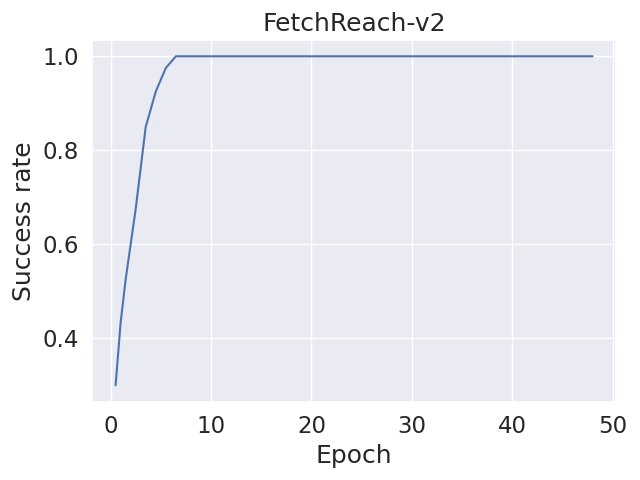
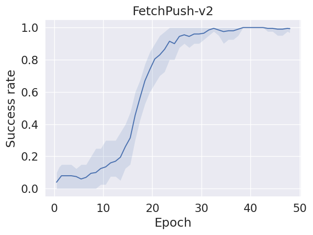
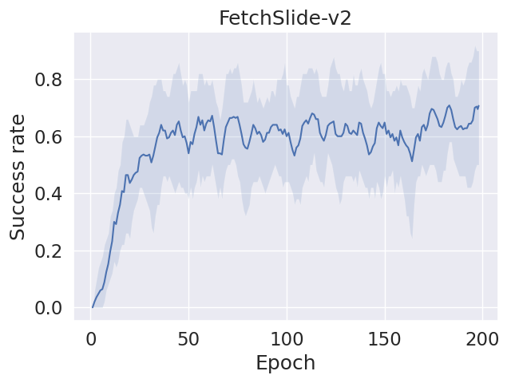

# DDPG+HER  for Fetch Robot

# DDPG (Deep Deterministic Policy Gradient):

Type: DDPG is a type of reinforcement learning algorithm.
Usage: It is particularly well-suited for continuous action spaces, which makes it suitable for robotic control tasks where actions are often smooth and continuous.

# HER (Hindsight Experience Replay):

Purpose: HER is a technique used to address the sparse reward problem in reinforcement learning.
Sparse Reward Problem: In many robotic tasks, the agent receives sparse or delayed rewards, making it challenging for the learning algorithm to understand which actions led to success or failure.
How HER Works: It allows the agent to learn from failures by considering alternative goals and updating its policy based on the outcomes.
Fetch Robot Task:

# DDPG+HER

Integration: This phrase indicates the combination of the DDPG algorithm with the HER technique for the purpose of training a robot to perform tasks in a Fetch environment.
Benefits: The combination of DDPG and HER is powerful because DDPG is effective in continuous action spaces, while HER helps address the challenges of sparse rewards, enabling more efficient learning in complex environments.
In summary, DDPG+HER for Fetch Robot Task represents an approach to training a robotic agent using a reinforcement learning algorithm (DDPG) along with a technique (HER) designed to enhance learning in scenarios where rewards are sparse or delayed, which is common in tasks involving manipulation and interaction with objects (Fetch Robot Task). This combination aims to improve the efficiency and effectiveness of training robots for complex tasks.

# Results

# Reference
Open AI: https://doi.org/10.48550/arXiv.1707.01495
